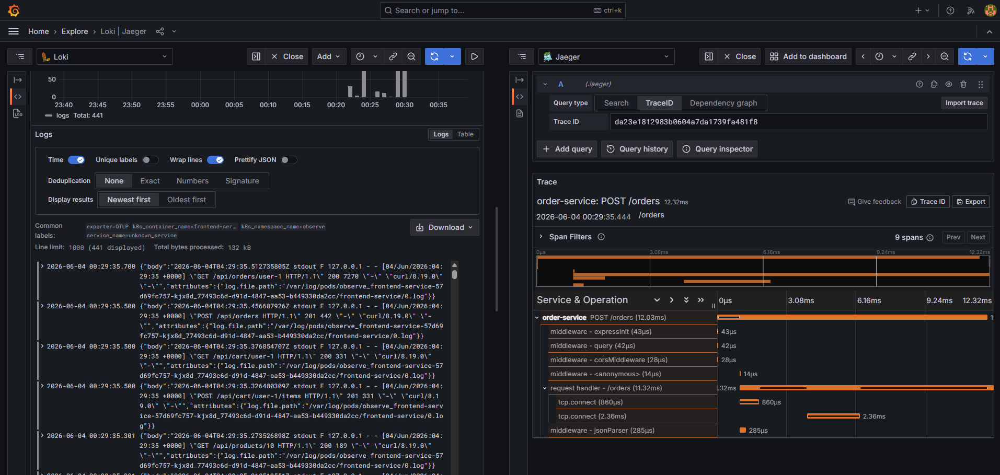
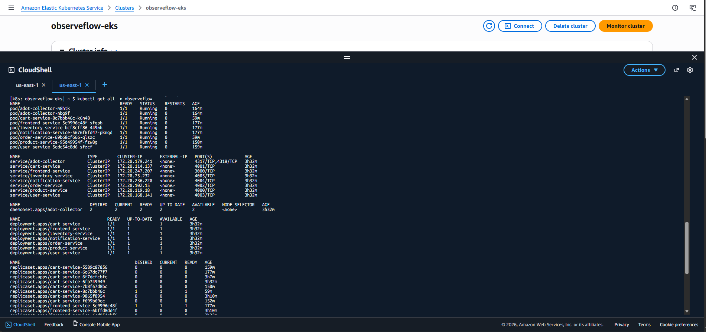
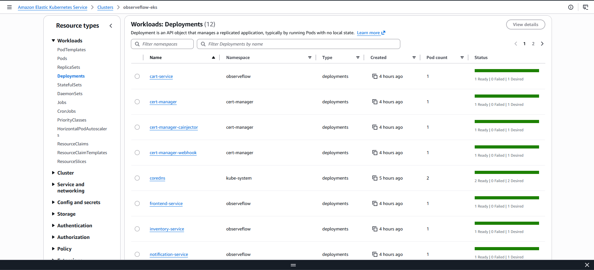
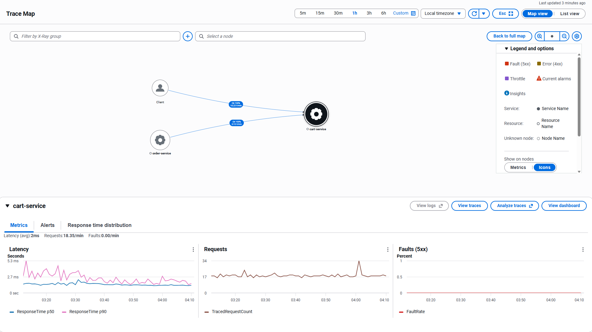
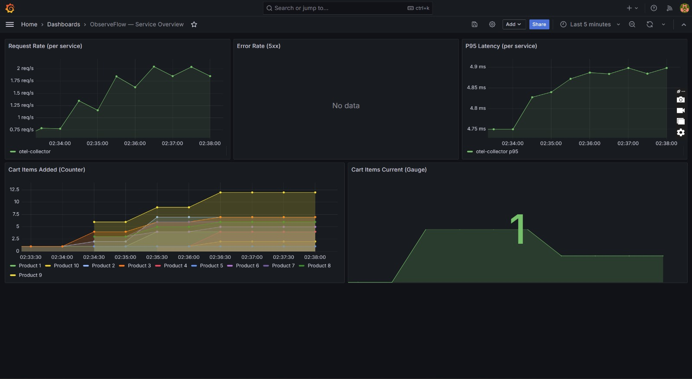
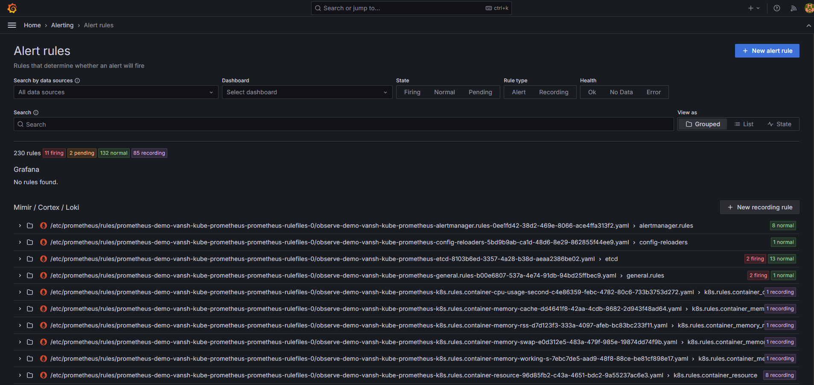
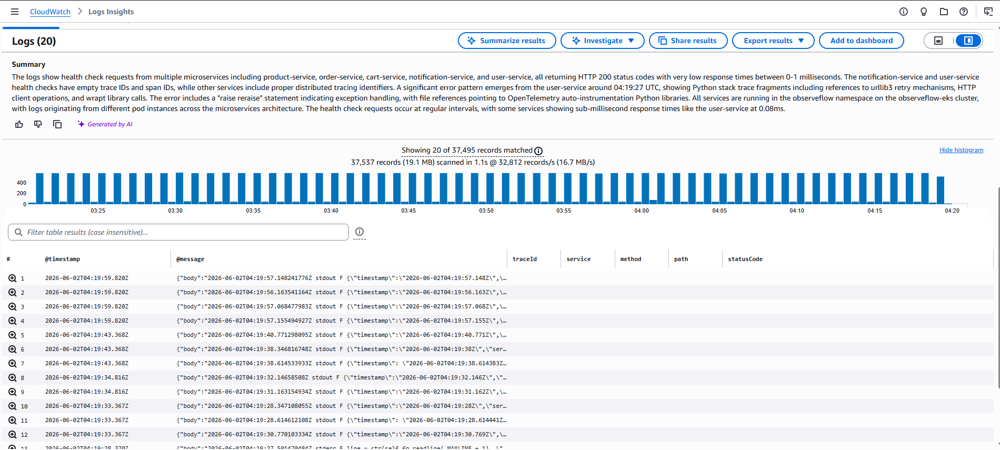
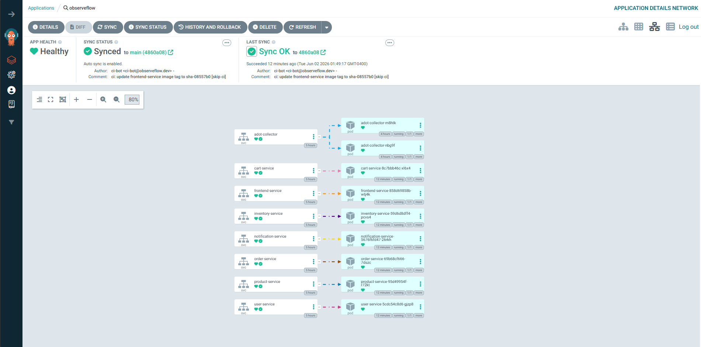

# 🔭 ObserveFlow

**A polyglot microservices e-commerce application with end-to-end observability — distributed tracing, metrics, and log aggregation — powered by OpenTelemetry, AWS ADOT, and a full cloud-native stack.**

[](https://kubernetes.io/)
[](https://helm.sh/)
[](https://aws.amazon.com/eks/)
[](https://www.terraform.io/)
[](https://opentelemetry.io/)
[](https://prometheus.io/)
[](https://grafana.com/)
[](https://www.jaegertracing.io/)
[](https://github.com/features/actions)
[](https://www.docker.com/)
[](https://argoproj.github.io/cd/)
[](https://aws.amazon.com/xray/)
[](https://aws.amazon.com/cloudwatch/)

ObserveFlow deploys 7 microservices written in 4 languages (Node.js, Python, Go, Java) as a functional e-commerce app. The real focus is the **observability layer**: OpenTelemetry auto-instrumentation injects tracing into every service with zero code changes, an OTel Collector pipelines telemetry to Jaeger, Prometheus, and Loki for local clusters — or to **AWS ADOT → X-Ray, Amazon Managed Prometheus (AMP), and CloudWatch Logs** on EKS. The entire infrastructure (VPC, EKS, ECR, Karpenter, IAM, KMS) is provisioned via Terraform, with CI/CD through GitHub Actions (OIDC → ECR) and GitOps via ArgoCD.



---

## 🏗️ Architecture

```
┌─────────────────────────────────────────────────────────────────────────┐
│                          KUBERNETES CLUSTER                              │
│                                                                         │
│  ┌──────────┐    ┌──────────────┐    ┌──────────────┐                  │
│  │ Frontend │───▶│Product Service│    │ User Service │                  │
│  │  (React) │    │  (Node.js)   │    │   (Python)   │                  │
│  └────┬─────┘    └──────────────┘    └──────────────┘                  │
│       │                                                                 │
│       ├──────────┐                                                      │
│       ▼          ▼                                                      │
│  ┌──────────┐  ┌──────────────┐  ┌───────────────────┐                │
│  │Cart Svc  │◀─│ Order Service │─▶│Notification Service│                │
│  │(Node.js) │  │  (Node.js)   │  │       (Go)         │                │
│  └──────────┘  └──────┬───────┘  └───────────────────┘                │
│                        │                                                │
│                        ▼                                                │
│               ┌─────────────────┐                                       │
│               │Inventory Service│                                       │
│               │     (Java)      │                                       │
│               └─────────────────┘                                       │
│                                                                         │
│  ═══════════════════ OBSERVABILITY LAYER ═══════════════════════════    │
│                                                                         │
│  ┌────────────────────┐                                                │
│  │  OTel Operator      │ ← Auto-injects instrumentation into pods      │
│  │  (Instrumentation)  │                                                │
│  └────────┬───────────┘                                                │
│           ▼                                                             │
│  ┌────────────────────┐    ┌──────────┐  ┌──────┐  ┌──────┐          │
│  │  OTel Collector     │───▶│  Jaeger  │  │ Prom │  │ Loki │          │
│  │  (traces/metrics/   │───▶│ (traces) │  │(met.)│  │(logs)│          │
│  │   logs pipeline)    │───▶│          │  │      │  │      │          │
│  └────────────────────┘    └──────────┘  └──┬───┘  └──┬───┘          │
│                                              │         │               │
│                                        ┌─────▼─────────▼────┐         │
│                                        │      Grafana        │         │
│                                        │  (unified UI)       │         │
│                                        └─────────────────────┘         │
└─────────────────────────────────────────────────────────────────────────┘
```

---

## ☁️ Dual-Mode Observability (Local + AWS)

ObserveFlow supports **two deployment modes** with different observability backends:

| | **Local Mode** (Kind/Minikube) | **AWS Mode** (EKS) |
|--|------|------|
| Traces | Jaeger (in-cluster) | AWS X-Ray |
| Metrics | Prometheus + Grafana (in-cluster) | Amazon Managed Prometheus (AMP) |
| Logs | Loki + Grafana (in-cluster) | CloudWatch Logs (KMS-encrypted) |
| Collector | OTel Collector | ADOT Collector (DaemonSet) |
| Auth | — | Pod Identity (no keys) |
| Autoscaling | — | Karpenter (spot instances) |

Switch between modes with a single flag:

```yaml
# values.yaml
observability:
  aws:
    enabled: true   # ← switches to ADOT → X-Ray/AMP/CloudWatch
```

---

## 🏗️ AWS Infrastructure (Terraform)

The entire AWS stack is provisioned via Terraform (75 resources):




```
┌─────────────────────────────────────────────────────────────────────────┐
│                            AWS ACCOUNT                                   │
│                                                                         │
│  ┌────────────────── VPC (10.0.0.0/16) ───────────────────────────┐    │
│  │                                                                 │    │
│  │  ┌─── Public Subnets ───┐    ┌─── Private Subnets ───┐        │    │
│  │  │  • NAT Gateway       │    │  • EKS Node Group      │        │    │
│  │  │  • Internet Gateway  │    │  • Karpenter Nodes     │        │    │
│  │  │  • Load Balancers    │    │  • Application Pods    │        │    │
│  │  └──────────────────────┘    └────────────────────────┘        │    │
│  └─────────────────────────────────────────────────────────────────┘    │
│                                                                         │
│  ┌──── EKS Cluster ─────────────────────────────────────────────────┐  │
│  │  K8s v1.35 │ API + Config Map auth │ Pod Identity Agent          │  │
│  │  Addons: VPC-CNI, CoreDNS, kube-proxy, ADOT, Pod Identity       │  │
│  └──────────────────────────────────────────────────────────────────┘  │
│                                                                         │
│  ┌──── ECR ─────────┐  ┌── Observability ────────────────────────┐    │
│  │  7 repositories   │  │  • Amazon Managed Prometheus (AMP)      │    │
│  │  Immutable tags   │  │  • CloudWatch Logs (365d retention)     │    │
│  │  Scan on push     │  │  • AWS X-Ray (distributed tracing)     │    │
│  │  Auto-cleanup     │  │  • KMS encryption for logs             │    │
│  └───────────────────┘  └────────────────────────────────────────┘    │
│                                                                         │
│  ┌──── Karpenter ────────────────────────────────────────────────┐    │
│  │  • Pod Identity for EC2 management                             │    │
│  │  • Spot interruption handling (SQS + EventBridge)              │    │
│  │  • Auto-discovery via subnet/SG tags                           │    │
│  └────────────────────────────────────────────────────────────────┘    │
│                                                                         │
│  ┌──── CI/CD ────────────────────────────────────────────────────┐    │
│  │  • GitHub OIDC Provider (no long-lived credentials)            │    │
│  │  • IAM Role for GitHub Actions → ECR push                      │    │
│  │  • ArgoCD auto-sync (prune + self-heal)                        │    │
│  └────────────────────────────────────────────────────────────────┘    │
└─────────────────────────────────────────────────────────────────────────┘
```

### Terraform Modules

| File | What it provisions |
|------|-------------------|
| `vpc.tf` | VPC, 2 public + 2 private subnets, IGW, NAT, route tables |
| `eks.tf` | EKS cluster, managed node group, addons (VPC-CNI, CoreDNS, Pod Identity) |
| `ecr.tf` | 7 ECR repos with immutable tags, scan-on-push, lifecycle cleanup |
| `observability.tf` | AMP workspace, CloudWatch log group (KMS), ADOT IAM role + Pod Identity |
| `karpenter.tf` | Controller IAM role, node role + instance profile, SQS interruption queue, EventBridge rules |
| `github-oidc.tf` | OIDC provider, IAM role for GitHub Actions (ECR push) |

### Deploy AWS Infrastructure

```bash
cd terraform
cp terraform.tfvars.example terraform.tfvars  # Configure your values
terraform init
terraform plan
terraform apply

# Connect to the cluster
aws eks update-kubeconfig --name observeflow-eks --region us-east-1
```

---

## 🎯 What This Project Demonstrates

| Concept | Implementation |
|---------|---------------|
| **Distributed Tracing** | Auto-instrumented traces flow across all 7 services → OTel Collector → Jaeger / X-Ray |
| **Metrics Collection** | Custom business metrics (Counter, Gauge, Histogram) + HTTP metrics → Prometheus / AMP |
| **Log Aggregation** | Structured JSON logs with trace correlation → Loki / CloudWatch Logs |
| **Trace-Log Correlation** | Every log line includes `traceId` + `spanId` for direct jump from log → trace |
| **Auto-Instrumentation** | Zero-code OTel injection via Kubernetes Operator (no SDK changes needed) |
| **Custom Business Metrics** | Cart items added (Counter), current cart size (Gauge), operation latency (Histogram) |
| **Polyglot Observability** | Same pipeline works for Node.js, Python, Go, and Java services |
| **Helm-based Deployment** | One chart installs everything: services + full observability stack |
| **Multi-Arch Images** | All Docker images support `linux/amd64` + `linux/arm64` (Mac M-series compatible) |
| **GitOps-Ready** | ArgoCD application manifest + CI pipeline with auto-sync |
| **Infrastructure as Code** | Terraform provisions 75 AWS resources (EKS, ECR, VPC, AMP, Karpenter) |
| **AWS-Native Observability** | ADOT Collector → X-Ray (traces) + AMP (metrics) + CloudWatch (logs) |
| **Kubernetes Autoscaling** | Karpenter with spot instance interruption handling |
| **Security Best Practices** | Pod Identity (no keys), KMS encryption, OIDC for CI/CD, immutable image tags |
| **Container Security** | Trivy CVE scanning, Hadolint Dockerfile linting, npm audit |

---

## 📦 Services

| Service | Language | Port | Responsibility |
|---------|----------|------|----------------|
| **frontend-service** | React + Nginx | 3000 | E-commerce UI with product browsing, cart, and checkout |
| **product-service** | Node.js (Express) | 4000 | Product catalog (10 items with images, pricing) |
| **cart-service** | Node.js (Express) | 4001 | Shopping cart CRUD + custom OTel metrics |
| **order-service** | Node.js (Express) | 4002 | Order creation (calls cart → inventory → notification) |
| **user-service** | Python (Flask) | 4003 | User profiles and membership tiers |
| **notification-service** | Go (net/http) | 4004 | Event notifications with W3C traceparent parsing |
| **inventory-service** | Java (Spring Boot) | 4005 | Stock management with reserve/release/restock |

---

## 🚀 Quick Start

### Prerequisites

- Kubernetes cluster (Kind, Minikube, EKS, or any k8s)
- Helm v3
- kubectl

### One-Command Install

```bash
bash scripts/setup.sh my-namespace
```

This script installs everything in order:
1. cert-manager (TLS for OTel Operator webhooks)
2. OpenTelemetry Operator (auto-instrumentation injection)
3. ObserveFlow chart (7 services + Prometheus + Grafana + Loki + Jaeger)
4. Triggers pod restart to inject instrumentation

### Manual Install (Helm Repo)

```bash
# Add the ObserveFlow Helm repository
helm repo add observeflow https://vanshshah174.github.io/ObserveFlow
helm repo update

# Install prerequisites
helm install cert-manager jetstack/cert-manager \
  -n cert-manager --create-namespace \
  --set crds.enabled=true --wait

helm install otel-operator open-telemetry/opentelemetry-operator \
  -n otel-system --create-namespace \
  --set "manager.collectorImage.repository=otel/opentelemetry-collector-contrib" \
  --wait

# Install ObserveFlow
helm install demo observeflow/observeflow \
  -n observeflow --create-namespace

# Restart pods to inject auto-instrumentation
kubectl rollout restart deployment -n observeflow
```

### Access Dashboards

```bash
# Frontend (e-commerce app)
kubectl port-forward svc/frontend-service 3000:3000 -n observeflow

# Grafana (metrics + logs)
kubectl port-forward svc/demo-grafana 3001:80 -n observeflow
# → http://localhost:3001 (admin / admin)

# Jaeger (distributed traces)
kubectl port-forward svc/demo-jaeger-query 16686:16686 -n observeflow
# → http://localhost:16686
```

### Generate Traffic

```bash
bash scripts/generate-load.sh 60
```

This sends realistic e-commerce traffic (browse → add to cart → checkout) for 60 seconds, generating traces, metrics, and logs across all services.

---

## 🔍 Observability Stack

### Traces (Jaeger / AWS X-Ray)



Every HTTP request generates a distributed trace that spans multiple services:

```
Frontend → Product Service → (user browses)
Frontend → Cart Service → (adds item)
Frontend → Order Service → Cart Service → Inventory Service → Notification Service (checkout)
```

Each trace shows:
- Full request lifecycle across services
- Individual span durations (middleware, handlers, downstream calls)
- Service metadata (pod name, namespace, container)

### Metrics (Prometheus + Grafana)




**Built-in dashboard** with:
- Request rate per service (req/s)
- Error rate (5xx responses)
- P95 latency per service
- Cart items added (business counter)
- Current items in carts (business gauge)

**Custom business metrics** (cart-service):
```
cart_items_added_total    → Counter: total items added to carts
cart_items_current        → UpDownCounter: items currently in active carts
cart_operation_duration_seconds → Histogram: p50/p95/p99 of cart operations
```

**PromQL examples:**
```promql
# Request rate per service
sum(rate(observeflow_http_server_duration_milliseconds_count[5m])) by (job)

# Cart items added by product
sum(observeflow_cart_items_added_total) by (product_id)

# P95 latency
histogram_quantile(0.95, sum(rate(observeflow_http_server_duration_milliseconds_bucket[5m])) by (le, job))
```

### Logs (Loki + Grafana / CloudWatch)



All services emit structured JSON logs with trace correlation:

```json
{
  "timestamp": "2026-06-04T12:00:01.234Z",
  "service": "cart-service",
  "method": "POST",
  "path": "/cart/user-1/items",
  "statusCode": 201,
  "durationMs": 5,
  "traceId": "2ebad82367f07b870f4c3a8c44ff8058",
  "spanId": "0234e0930ce83e94"
}
```

**LogQL examples:**
```logql
# All cart service logs (excluding health checks)
{k8s_container_name="cart-service"} | json | path!="/health"

# Slow requests (>100ms)
{k8s_container_name=~"cart-service|order-service"} | json | durationMs > 100

# Filter by trace ID (jump from Jaeger → Loki)
{k8s_container_name=~".+"} | json | traceId="2ebad82367f07b870f4c3a8c44ff8058"
```

---

## 🔗 Trace-Log-Metric Correlation

The key power of this setup is **correlation across all three signals**:

1. **See a spike in Grafana** (metric) → click to see which traces were slow
2. **Open a trace in Jaeger** → copy the `traceId` → search in Loki logs
3. **Find an error in logs** (Loki) → use `traceId` to see the full distributed trace

This is possible because:
- Auto-instrumentation injects trace context into every request
- Each service's logging middleware captures `traceId` + `spanId`
- OTel Collector routes all signals through a single pipeline

---

## 📂 Project Structure

```
ObserveFlow/
├── src/
│   ├── frontend-service/     # React + Vite + Nginx reverse proxy
│   ├── product-service/      # Node.js — product catalog
│   ├── cart-service/         # Node.js — cart + custom OTel metrics
│   ├── order-service/        # Node.js — order processing (multi-service calls)
│   ├── user-service/         # Python Flask — user profiles
│   ├── notification-service/ # Go — event notifications
│   └── inventory-service/    # Java Spring Boot — stock management
├── helm/
│   └── observeflow/          # Helm chart (single installable package)
│       ├── Chart.yaml        # Chart metadata + subchart dependencies
│       ├── values.yaml       # Default configuration
│       ├── values-dev.yaml   # Dev overrides (auto-updated by CI)
│       ├── templates/
│       │   ├── frontend/
│       │   ├── cart-service/
│       │   ├── product-service/
│       │   ├── order-service/
│       │   ├── user-service/
│       │   ├── notification-service/
│       │   ├── inventory-service/
│       │   ├── gateway/           # AWS VPC Lattice Gateway API
│       │   ├── karpenter/         # NodePool + EC2NodeClass CRDs
│       │   └── observability/     # OTel Collector, ADOT, Grafana, dashboards
│       └── charts/                # Bundled subcharts (Prometheus, Loki, Jaeger)
├── terraform/
│   ├── vpc.tf                # VPC, subnets, NAT, IGW, route tables
│   ├── eks.tf                # EKS cluster, node group, addons
│   ├── ecr.tf                # 7 ECR repositories with lifecycle policies
│   ├── observability.tf      # AMP, CloudWatch Logs, KMS, ADOT IAM role
│   ├── karpenter.tf          # Karpenter IAM, Pod Identity, SQS, EventBridge
│   ├── github-oidc.tf        # GitHub Actions OIDC provider + IAM role
│   ├── iam.tf                # EKS cluster/node IAM roles
│   ├── variables.tf          # Input variables
│   └── outputs.tf            # Exported values for Helm/CI
├── argocd/
│   └── application.yaml      # GitOps manifest for ArgoCD
├── scripts/
│   ├── setup.sh              # One-command full deployment
│   ├── generate-load.sh      # Traffic generator for demo
│   └── port-forward.sh       # Port-forward all dashboards
├── .github/workflows/
│   ├── ci.yaml               # Build + scan + push + update Helm tags
│   └── helm-release.yaml     # Package + publish chart to GitHub Pages
└── docs/                     # Architecture decisions and journey docs
```

---

## ⚙️ Telemetry Pipeline

### Local Mode (OTel Collector)

```
┌─────────────────────────────────────────────────────────┐
│ OTel Operator watches pods with annotation:             │
│   instrumentation.opentelemetry.io/inject-nodejs: true  │
│   instrumentation.opentelemetry.io/inject-python: true  │
│                                                         │
│ Injects init container with OTel SDK into each pod      │
└────────────────────┬────────────────────────────────────┘
                     ▼
┌─────────────────────────────────────────────────────────┐
│ Services emit telemetry (OTLP HTTP/protobuf)            │
│   → Traces (spans for every HTTP request)               │
│   → Metrics (counters, histograms, gauges)              │
│   → Logs (structured JSON via stdout)                   │
└────────────────────┬────────────────────────────────────┘
                     ▼
┌─────────────────────────────────────────────────────────┐
│ OTel Collector (Deployment)                             │
│   Receivers:  OTLP gRPC (:4317) + HTTP (:4318)         │
│   Processors: batch, memory_limiter, resource           │
│   Exporters:                                            │
│     traces  → Jaeger (OTLP/gRPC)                       │
│     metrics → Prometheus (scrape endpoint :8889)        │
│     logs    → Loki (push API)                           │
└─────────────────────────────────────────────────────────┘
```

### AWS Mode (ADOT Collector)

```
┌─────────────────────────────────────────────────────────┐
│ ADOT Collector (DaemonSet — runs on every node)         │
│   Auth: Pod Identity → IAM Role (no access keys)        │
│                                                         │
│   Receivers:                                            │
│     • OTLP gRPC/HTTP (traces + metrics from services)  │
│     • filelog (container logs from /var/log/pods/)      │
│                                                         │
│   Exporters:                                            │
│     traces  → AWS X-Ray (awsxray exporter)             │
│     metrics → AMP (prometheusremotewrite + sigv4auth)  │
│     logs    → CloudWatch Logs (awscloudwatchlogs)      │
└─────────────────────────────────────────────────────────┘
```

---

## 🏷️ Helm Chart Configuration

The chart is fully configurable. Key values:

```yaml
# Enable/disable the observability stack
observability:
  enabled: true   # Set false to deploy only microservices

# Per-service image override
cartService:
  image:
    repository: vanshshah17/observeflow-cart-service
    tag: "latest"
  replicas: 1

# AWS mode (for EKS with ADOT)
observability:
  aws:
    enabled: true
    region: "us-east-1"
    ampEndpoint: "https://aps-workspaces.us-east-1..."
```

The chart is **namespace-agnostic** — install into any namespace and all internal service references resolve automatically using `.Release.Namespace`.

---

## 🛠️ CI/CD

### CI Pipeline (`.github/workflows/ci.yaml`)

Triggered on push to `main` when `src/` changes:

```
Detect Changes → Lint (ESLint) → SCA (npm audit) → Hadolint → Build + Trivy → Push → Update Helm
```

1. **Dynamic service detection** — only builds services with code changes
2. **ESLint** — code quality check per service
3. **npm audit** — dependency vulnerability scan
4. **Hadolint** — Dockerfile best practices
5. **Trivy** — container image CVE scan (blocks on CRITICAL/HIGH)
6. **Push** — multi-registry push (ECR + Docker Hub) via GitHub OIDC (no stored credentials)
7. **Update Helm** — commits new image tag to `values-dev.yaml` → triggers ArgoCD auto-sync

### Helm Release Pipeline (`.github/workflows/helm-release.yaml`)

Triggered when `Chart.yaml` version changes:
1. Packages the Helm chart with all dependencies
2. Updates the Helm repo index
3. Publishes to GitHub Pages (`https://vanshshah174.github.io/ObserveFlow`)

### GitOps (ArgoCD)



```yaml
# argocd/application.yaml
spec:
  syncPolicy:
    automated:
      prune: true      # Remove orphaned resources
      selfHeal: true   # Revert manual cluster changes
```

ArgoCD watches `helm/observeflow/values-dev.yaml` — when CI updates an image tag, ArgoCD automatically deploys the new version with zero manual intervention.

---

## 🖥️ Multi-Platform Support

All Docker images are built for both `linux/amd64` and `linux/arm64`:

- ✅ Intel/AMD machines (Windows, Linux)
- ✅ Apple Silicon Macs (M1/M2/M3)
- ✅ AWS Graviton instances
- ✅ Any ARM64 Kubernetes node

---

## 📡 API Reference

### Product Service `:4000`
| Method | Endpoint | Description |
|--------|----------|-------------|
| GET | `/products` | List all products |
| GET | `/products/:id` | Get single product |
| GET | `/health` | Health check |

### Cart Service `:4001`
| Method | Endpoint | Description |
|--------|----------|-------------|
| GET | `/cart/:userId` | Get user's cart |
| POST | `/cart/:userId/items` | Add item to cart |
| DELETE | `/cart/:userId/items/:itemId` | Remove item |
| GET | `/health` | Health check |

### Order Service `:4002`
| Method | Endpoint | Description |
|--------|----------|-------------|
| POST | `/orders` | Create order (clears cart, reserves inventory) |
| GET | `/orders/:userId` | Get user's orders |
| GET | `/health` | Health check |

### User Service `:4003`
| Method | Endpoint | Description |
|--------|----------|-------------|
| GET | `/users` | List all users |
| GET | `/users/:userId` | Get user profile |
| POST | `/users` | Create user |
| PUT | `/users/:userId/profile` | Update profile |
| GET | `/health` | Health check |

### Notification Service `:4004`
| Method | Endpoint | Description |
|--------|----------|-------------|
| GET | `/notifications/:userId` | Get user's notifications |
| POST | `/notifications` | Create notification |
| PUT | `/notifications/:userId/:notifId/read` | Mark as read |
| GET | `/health` | Health check |

### Inventory Service `:4005`
| Method | Endpoint | Description |
|--------|----------|-------------|
| GET | `/inventory` | Get all inventory |
| GET | `/inventory/:productId` | Get stock for product |
| POST | `/inventory/:productId/reserve` | Reserve stock |
| POST | `/inventory/:productId/release` | Release reserved stock |
| POST | `/inventory/:productId/restock` | Restock product |
| GET | `/health` | Health check |

---

## 🧰 Tech Stack

| Layer | Technology |
|-------|-----------|
| Frontend | React 18 + Vite + React Router |
| Backend | Node.js, Python (Flask), Go, Java (Spring Boot) |
| Reverse Proxy | Nginx (dynamic upstream resolution via CoreDNS) |
| Orchestration | Kubernetes (EKS / Kind) + Helm v3 |
| Tracing | OpenTelemetry → Jaeger (local) / AWS X-Ray (prod) |
| Metrics | Prometheus + Grafana (local) / Amazon Managed Prometheus (prod) |
| Logs | Loki + Grafana (local) / CloudWatch Logs (prod) |
| Collector | OpenTelemetry Collector (local) / ADOT Collector (AWS) |
| Auto-Instrumentation | OpenTelemetry Operator (K8s CRD) |
| Infrastructure | Terraform (VPC, EKS, ECR, IAM, KMS, AMP, Karpenter) |
| Autoscaling | Karpenter (spot instances + interruption handling) |
| Container Registry | ECR (AWS) + Docker Hub (public multi-arch) |
| CI/CD | GitHub Actions (OIDC → ECR) + ArgoCD (GitOps) |
| Security | Pod Identity, KMS encryption, Trivy, Hadolint, OIDC |

---

## 📄 License

MIT

---

## 👤 Author

**Vansh Shah** — [GitHub](https://github.com/VanshShah174)
